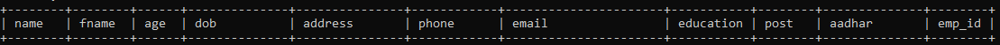

# Employee-Management-System

* This project is a simple swing based gui application. 
* The code is written in Object Oriented Manner. There is no drag and drop of gui swing components. 
* The code mainly consists of 10 classes that handle all the functionality.
* There is a seperate database that contains the information of all the employees.

## Functionalities / Features

* There is a login page for the admin of the system
* After logging in the admin can add an employee , delete an employee , view the details of any employee or update the information
of any employee
* To update any employee first there is a search bar to search that employee. We can search an employee that is stored in the database using employee id.
* All these functionality is handled by 9 classes
* There is a separate class that handles the connection of the application with the database

## Libraries / Tools Used

* We have used Swing GUI widget toolkit for Java
* MySql Database.
* MySql JDBC connector for java. More specifically version **(mysql:mysql-connector-java:8.0.19)**
* JDK 13 is used.
* For writing the code we used IntelliJ IDEA 

## Database Structure
* We have a database that contains two tables namely login table and employee table.
* Login table contains the information about the password and username of admins.
* Employee table contains all the details of the employees.
* Employee table has the below shown structure

